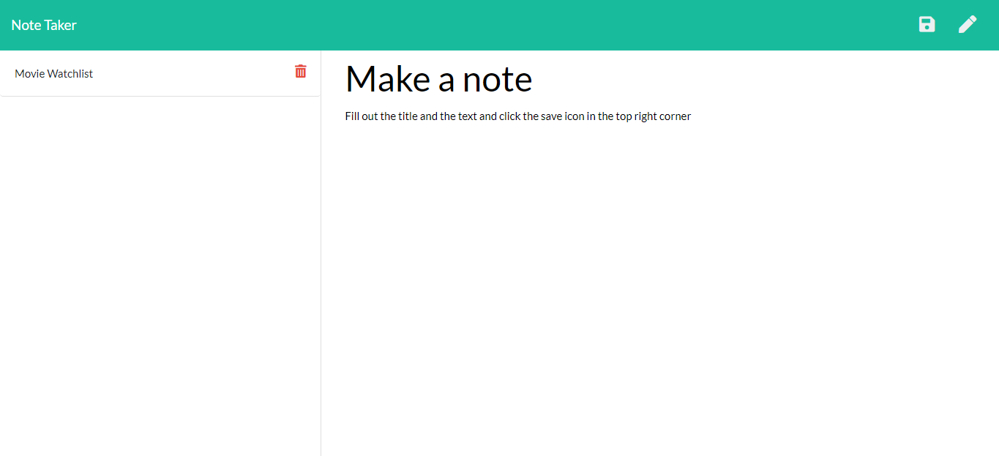

# Note Taker

## Description
An application that can be used for writing notes which can be saved and deleted.

The user can create a new note by clicking 'Get Started' and filling out the note title and the note text which will then allow the user to click the save icon in the top right corner. Once saved, the note will appear to the left sidebar and can be viewed when clicked on. Notes can be deleting by clicking on the trash can icon.

To get a list of all saved notes in json format, users can go to `/api/notes` and view the list.   

Click [HERE](https://note-taker-web.herokuapp.com/) for the deployed application

## Technologies
* Node.js
* Express
* [UUID](https://www.npmjs.com/package/uuid)

## Example

## Contributing
Feel free to submit pull requests for small issues.

# License
Copyright (c) 2020 Chase Edwards    
License Under the [MIT License](License)
